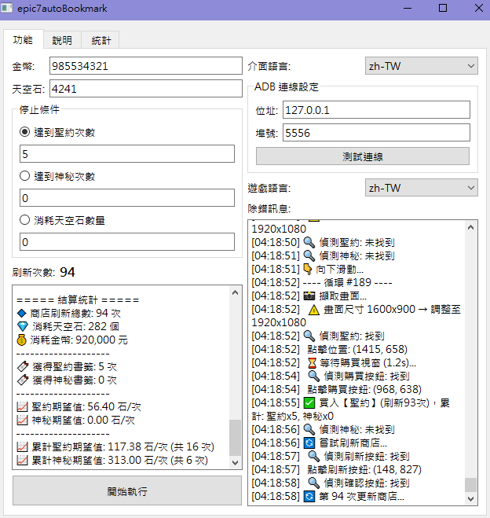

# Epic7 Auto Bookmark 第七史詩自動刷書籤

[繁體中文](#繁體中文) | [English](#english)

---

## 繁體中文

一個基於 PyQt6 的桌面工具，透過 ADB 與 OpenCV 模板匹配自動在第七史詩的秘密商店中購買**聖約書籤**和**神秘書籤**。

### 引用及鳴謝

本專案基於 [Ryan-Du929/epic7autoBookmark](https://github.com/Ryan-Du929/epic7autoBookmark)，使用 DeepSeek v4 進行開發改良。

亦鳴謝 [steven010116/epic7autoBookmark](https://github.com/steven010116/epic7autoBookmark)。


### 功能特色

- **無需設定檔** — 所有設定透過 `QSettings` 儲存在 Windows 登錄檔中，自動儲存、自動載入
- **雙主控台日誌** — 左側顯示重要訊息，右側顯示除錯/診斷訊息
- **多解析度支援** — 截圖自動縮放至 1920×1080 再進行匹配；點擊座標會等比縮放回裝置實際解析度
- **累計統計** — 「統計」分頁記錄所有執行階段的累計數據，並以累計期望值計算
- **三種停止條件** — 達到聖約次數、達到神秘次數、或消耗天空石數量



### 需求

- Windows 10+
- Python 3.10+（或從 Releases 下載已封裝的 `.exe`）
- 運行第七史詩的 Android 模擬器或裝置（需停留在秘密商店畫面）
- 模擬器/裝置需啟用 ADB

### 快速開始

```bash
git clone https://github.com/vincentkilua/epic7autoBookmark.git
cd epic7autoBookmark
python -m venv .venv
source .venv/Scripts/activate   # 或: .venv\Scripts\activate
pip install -r requirements.txt
python main.py
```

### 使用方式

1. **右側設定面板** — 輸入模擬器的 ADB 位址與埠號，選擇遊戲語言
2. **左側控制面板** — 輸入當前遊戲中的金幣和天空石數量，選擇停止條件
3. 點擊 **開始執行** 開始，點擊 **停止執行** 停止
4. **統計分頁** 顯示所有階段的累計數據與期望值

### 模板圖片

模板圖片位於 `img/` 目錄下，以 1920×1080 解析度擷取。若模擬器解析度不同，截圖會自動縮放，無需重新擷取。

| 檔案 | 用途 |
|------|------|
| `covenantLocation.png` | 商店列表中的聖約書籤圖示 |
| `mysticLocation.png` | 商店列表中的神秘書籤圖示 |
| `buyButton-{lang}.png` | 購買/確認按鈕（依語言） |
| `refreshButton.png` | 刷新按鈕 |
| `refreshYesButton-{lang}.png` | 刷新確認「是」按鈕（依語言） |

### 預設值

| 欄位 | 預設值 |
|-------|---------|
| 金幣 | 987,654,321 |
| 天空石 | 5,000 |
| 聖約目標 | 50 |
| ADB 位址 | 127.0.0.1:5555 |
| 語言 | zh-TW |

---

## English

A PyQt6 desktop tool to automate buying **covenant** and **mystic bookmarks** from the Epic Seven secret shop via ADB and OpenCV template matching.

### Credits

This project is based on [Ryan-Du929/epic7autoBookmark](https://github.com/Ryan-Du929/epic7autoBookmark), developed and improved using DeepSeek v4.

Also thanks to [steven010116/epic7autoBookmark](https://github.com/steven010116/epic7autoBookmark).

### Features

- **No config file needed** — all settings persist in the Windows registry via `QSettings`, auto-saved and auto-loaded
- **Two-console logging** — important messages on the left, debug/diagnostic messages on the right
- **Multi-resolution support** — screenshots are normalized to 1920×1080 before matching; click coordinates scale back to your device's actual resolution
- **Cumulative stats** — a "統計" tab tracks lifetime totals across all sessions with cumulative expected values
- **Three stop conditions** — by covenant count, mystic count, or skystones spent

### Requirements

- Windows 10+
- Python 3.10+ (or use the prebuilt `.exe` from Releases)
- An Android emulator or device running Epic Seven (must be on the secret shop screen)
- ADB enabled on the emulator/device

### Quick Start

```bash
# Clone and set up
git clone https://github.com/vincentkilua/epic7autoBookmark.git
cd epic7autoBookmark
python -m venv .venv
source .venv/Scripts/activate   # or: .venv\Scripts\activate
pip install -r requirements.txt

# Run
python main.py
```

### Usage

1. **Settings tab (right panel)** — enter your emulator's ADB address and port, select game language
2. **Controls tab (left panel)** — enter your current in-game gold and skystone amounts, choose a stop condition
3. Click **開始執行** to start, **停止執行** to stop
4. The **統計 tab** shows cumulative stats from all sessions with expected values

### Template Images

Templates are under `img/`. They were captured at 1920×1080. If your emulator runs at a different resolution, the screenshots are auto-resized — no need to re-capture.

| File | Purpose |
|------|---------|
| `covenantLocation.png` | Covenant bookmark icon in shop list |
| `mysticLocation.png` | Mystic bookmark icon in shop list |
| `buyButton-{lang}.png` | Buy/confirm button (per language) |
| `refreshButton.png` | Refresh button |
| `refreshYesButton-{lang}.png` | Refresh confirmation "Yes" button (per language) |

### Default Values

| Field | Default |
|-------|---------|
| Gold | 987,654,321 |
| Skystones | 5,000 |
| Covenant target | 50 |
| ADB address | 127.0.0.1:5555 |
| Language | zh-TW |
